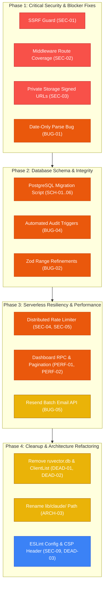

# Really-CRM: Full Technical Audit Report

**Repository:** [`Really-CRM`](file:///Users/eduardotorres/Developer/Really-CRM)  
**Evaluated Branch:** `main`  
**Date:** August 24, 2026  
**Scope:** Security, Code Quality & Runtime Bugs, Architecture, Performance, Technical Debt & Database Schema  
**Severity Scale:** 🚨 **CRITICAL** | 🔴 **HIGH** | 🟡 **MEDIUM** | 🟢 **LOW**  

---

## 1. Executive Summary

A comprehensive, line-by-line technical evaluation of the **Really-CRM** codebase was performed. Really-CRM is a real estate CRM application built with Next.js 16 (App Router), React 19, TypeScript 5, Tailwind CSS, Supabase (PostgreSQL, Auth, Storage), and Resend API.

The assessment evaluated 5 core engineering dimensions:
1. **Security & Data Privacy:** SSRF, authentication enforcement, public data leakage, rate limiting, and input sanitization.
2. **Code Quality & Runtime Bugs:** Date/timezone arithmetic, form schema validations, React rendering compliance, serverless timeout vulnerabilities, and storage lifecycle management.
3. **Architecture & Design Patterns:** Layer decoupling, server/client boundary responsibilities, session verification strategy, and modular structure.
4. **Performance & Scalability:** PostgREST query waterfalls, missing pagination, redundant client-side fetching, and bundle optimization.
5. **Technical Debt & Schema Integrity:** Dead code, binary repository bloat, foreign key indexing, database constraints, and immutable audit log automation.

### Summary Findings Breakdown

```
========================================================================================
 SEVERITY LEVEL     SECURITY    BUGS/QUALITY    ARCHITECTURE    PERFORMANCE    TECH DEBT    TOTAL
----------------------------------------------------------------------------------------
 🚨 CRITICAL            3             0               0              0             0          3
 🔴 HIGH                4             2               1              2             2         11
 🟡 MEDIUM              1             4               2              1             2         10
 🟢 LOW                 1             1               1              1             2          6
----------------------------------------------------------------------------------------
 TOTAL                 9             7               4              4             6         30
========================================================================================
```

---

## 2. Complete Severity Matrix

| ID | Dimension | Finding Title | Severity | Location |
| :--- | :--- | :--- | :---: | :--- |
| **SEC-01** | Security | Server-Side Request Forgery (SSRF) in Property Parser | 🚨 **CRITICAL** | [`lib/claude/propertyMatch.ts:107-115`](file:///Users/eduardotorres/Developer/Really-CRM/lib/claude/propertyMatch.ts#L107-L115) |
| **SEC-02** | Security | Incomplete Route and API Protection in Edge Middleware | 🚨 **CRITICAL** | [`middleware.ts:42-49`](file:///Users/eduardotorres/Developer/Really-CRM/middleware.ts#L42-L49) |
| **SEC-03** | Security | Sensitive Document Exposure via Public Storage URLs | 🚨 **CRITICAL** | [`lib/storage/uploadFile.ts:18-19`](file:///Users/eduardotorres/Developer/Really-CRM/lib/storage/uploadFile.ts#L18-L19) |
| **SEC-04** | Security | Ephemeral In-Memory Rate Limiter Fails in Serverless | 🔴 **HIGH** | [`lib/rateLimit.ts:2-15`](file:///Users/eduardotorres/Developer/Really-CRM/lib/rateLimit.ts#L2-L15) |
| **SEC-05** | Security | Follow-up Email API Endpoint Lacks Rate Limiting | 🔴 **HIGH** | [`app/api/send-followup-email/route.ts:10-35`](file:///Users/eduardotorres/Developer/Really-CRM/app/api/send-followup-email/route.ts#L10-L35) |
| **SEC-06** | Security | Hardcoded External Domain Fallback in Daily Cron Job | 🔴 **HIGH** | [`app/api/cron/send-daily-followups/route.ts:50`](file:///Users/eduardotorres/Developer/Really-CRM/app/api/cron/send-daily-followups/route.ts#L50) |
| **SEC-07** | Security | Wildcard & Character Injection in PostgREST ILIKE Filter | 🔴 **HIGH** | [`app/(app)/clients/page.tsx:54-56`](file:///Users/eduardotorres/Developer/Really-CRM/app/%28app%29/clients/page.tsx#L54-L56) |
| **SEC-08** | Security | Missing Client-Side Origin Fallback on Magic Link Login | 🟡 **MEDIUM** | [`app/(auth)/login/page.tsx:32`](file:///Users/eduardotorres/Developer/Really-CRM/app/%28auth%29/login/page.tsx#L32) |
| **SEC-09** | Security | Stale Third-Party Origin (`api.anthropic.com`) in CSP | 🟢 **LOW** | [`next.config.ts:9`](file:///Users/eduardotorres/Developer/Really-CRM/next.config.ts#L9) |
| **BUG-01** | Quality | Timezone Offset in Date-Only Follow-ups (`parseISO` UTC Bug) | 🔴 **HIGH** | [`components/follow-ups/FollowUpCard.tsx:27-30`](file:///Users/eduardotorres/Developer/Really-CRM/components/follow-ups/FollowUpCard.tsx#L27-L30) |
| **BUG-02** | Quality | Missing Numeric Boundary Validation & NaN Coercion | 🔴 **HIGH** | [`components/clients/ClientForm.tsx:31-45`](file:///Users/eduardotorres/Developer/Really-CRM/components/clients/ClientForm.tsx#L31-L45) |
| **BUG-03** | Quality | React Hook Form `watch()` Invoked Inside `.map()` Loop | 🟡 **MEDIUM** | [`components/clients/ClientForm.tsx:239`](file:///Users/eduardotorres/Developer/Really-CRM/components/clients/ClientForm.tsx#L239) |
| **BUG-04** | Quality | Silent History Loss on Kanban Drag-and-Drop Moves | 🟡 **MEDIUM** | [`components/pipeline/PipelineBoard.tsx:50-65`](file:///Users/eduardotorres/Developer/Really-CRM/components/pipeline/PipelineBoard.tsx#L50-L65) |
| **BUG-05** | Quality | Sequential Bulk Email Execution Causes Vercel Timeout | 🟡 **MEDIUM** | [`app/api/bulk-email/route.ts:70-95`](file:///Users/eduardotorres/Developer/Really-CRM/app/api/bulk-email/route.ts#L70-L95) |
| **BUG-06** | Quality | Document Deletion Leaves Orphaned Binary in Storage | 🟡 **MEDIUM** | [`components/documents/DocumentCard.tsx:48-55`](file:///Users/eduardotorres/Developer/Really-CRM/components/documents/DocumentCard.tsx#L48-L55) |
| **BUG-07** | Quality | Server-Rendered Today Calculation Out of Sync with Browser | 🟢 **LOW** | [`app/(app)/dashboard/page.tsx:16`](file:///Users/eduardotorres/Developer/Really-CRM/app/%28app%29/dashboard/page.tsx#L16) |
| **ARCH-01** | Architecture | Direct Database Mutations in UI Components (No Service Layer) | 🔴 **HIGH** | [`components/**/*.tsx`](file:///Users/eduardotorres/Developer/Really-CRM/components) |
| **ARCH-02** | Architecture | Redundant Session Lookups Across All Server Components | 🟡 **MEDIUM** | [`app/(app)/**/page.tsx`](file:///Users/eduardotorres/Developer/Really-CRM/app/%28app%29) |
| **ARCH-03** | Architecture | Misleading `lib/claude/` Module Path for Local Heuristic Code | 🟡 **MEDIUM** | [`lib/claude/propertyMatch.ts`](file:///Users/eduardotorres/Developer/Really-CRM/lib/claude/propertyMatch.ts) |
| **ARCH-04** | Architecture | Dynamic `import()` Calls Inside UI Event Handlers | 🟢 **LOW** | [`components/clients/tabs/FollowUpsTab.tsx:62`](file:///Users/eduardotorres/Developer/Really-CRM/components/clients/tabs/FollowUpsTab.tsx#L62) |
| **PERF-01** | Performance | 6 Independent HTTP Roundtrips on Dashboard Load | 🔴 **HIGH** | [`app/(app)/dashboard/page.tsx:26-33`](file:///Users/eduardotorres/Developer/Really-CRM/app/%28app%29/dashboard/page.tsx#L26-L33) |
| **PERF-02** | Performance | Unbounded Client List Query Missing Pagination | 🔴 **HIGH** | [`app/(app)/clients/page.tsx:48-64`](file:///Users/eduardotorres/Developer/Really-CRM/app/%28app%29/clients/page.tsx#L48-L64) |
| **PERF-03** | Performance | Eager Multi-Table Queries on Client Detail View | 🟡 **MEDIUM** | [`app/(app)/clients/[id]/page.tsx:29-34`](file:///Users/eduardotorres/Developer/Really-CRM/app/%28app%29/clients/%5Bid%5D/page.tsx#L29-L34) |
| **PERF-04** | Performance | Uncached Database Fetches on `TemplatePicker` Mount | 🟢 **LOW** | [`components/templates/TemplatePicker.tsx:32-50`](file:///Users/eduardotorres/Developer/Really-CRM/components/templates/TemplatePicker.tsx#L32-L50) |
| **DEAD-01** | Tech Debt | Orphaned Component `components/clients/ClientList.tsx` | 🟡 **MEDIUM** | [`components/clients/ClientList.tsx`](file:///Users/eduardotorres/Developer/Really-CRM/components/clients/ClientList.tsx) |
| **DEAD-02** | Tech Debt | 1.58 MB Orphaned SQLite Binary (`ruvector.db`) in Repo Root | 🟡 **MEDIUM** | [`ruvector.db`](file:///Users/eduardotorres/Developer/Really-CRM/ruvector.db) |
| **DEAD-03** | Tech Debt | ESLint Scopes External Astro Build Artifacts in `landing/` | 🟢 **LOW** | [`eslint.config.mjs:9-15`](file:///Users/eduardotorres/Developer/Really-CRM/eslint.config.mjs#L9-L15) |
| **DEAD-04** | Tech Debt | Unused Destructured Variable `_score` in Matching Logic | 🟢 **LOW** | [`lib/claude/propertyMatch.ts:250`](file:///Users/eduardotorres/Developer/Really-CRM/lib/claude/propertyMatch.ts#L250) |
| **SCH-01** | Database | Missing Foreign Key Index on `follow_ups(client_id)` | 🔴 **HIGH** | [`supabase/schema.sql:139-148`](file:///Users/eduardotorres/Developer/Really-CRM/supabase/schema.sql#L139-L148) |
| **SCH-02** | Database | Client History Inmutable Log Reliant on Client Calls | 🔴 **HIGH** | [`supabase/schema.sql:107-135`](file:///Users/eduardotorres/Developer/Really-CRM/supabase/schema.sql#L107-L135) |

---

## 3. Detailed Findings: Security & Data Privacy

### [SEC-01] Server-Side Request Forgery (SSRF) in Property Parser
- **Severity:** 🚨 **CRITICAL**
- **Affected File:** [`lib/claude/propertyMatch.ts:107-115`](file:///Users/eduardotorres/Developer/Really-CRM/lib/claude/propertyMatch.ts#L107-L115) and [`app/api/property-match/route.ts:33-42`](file:///Users/eduardotorres/Developer/Really-CRM/app/api/property-match/route.ts#L33-L42)
- **Vulnerability Mechanism:**  
  The endpoint `POST /api/property-match` takes any arbitrary string provided by an authenticated client and performs a server-side `fetch(safeUrl)`. It lacks protocol validation (allowing `file://`, `ftp://`, or internal HTTP schemes) and does not perform DNS resolution checks against private network CIDRs.
- **Exploitation & Impact:**  
  An attacker can specify internal addresses such as `http://169.254.169.254/latest/meta-data/` (AWS/cloud instance metadata), `http://localhost:5432` (internal database ports), or internal VPC container endpoints. The function reads up to 500,000 characters and returns snippets in the API response `property.rawDescription`, allowing exfiltration of IAM credentials, database configurations, and infrastructure details.
- **Remediation:**
  Validate the URL scheme (`http:` / `https:` only), resolve hostnames to IP addresses prior to fetching, and explicitly disallow private/loopback/link-local address spaces (`10.0.0.0/8`, `172.16.0.0/12`, `192.168.0.0/16`, `127.0.0.0/8`, `169.254.0.0/16`, `::1`, `fe80::/10`).

```typescript
import dns from 'node:dns/promises'
import ipaddr from 'ipaddr.js'

export async function validatePublicUrl(rawUrl: string): Promise<string> {
  const parsed = new URL(rawUrl)
  if (!['http:', 'https:'].includes(parsed.protocol)) {
    throw new Error('Invalid URL protocol')
  }

  const addresses = await dns.lookup(parsed.hostname, { all: true })
  for (const { address } of addresses) {
    const ip = ipaddr.parse(address)
    const range = ip.range()
    if (['loopback', 'private', 'linkLocal', 'carrierGradeNat', 'broadcast'].includes(range)) {
      throw new Error('Access to private/internal network addresses is forbidden')
    }
  }
  return parsed.toString()
}
```

---

### [SEC-02] Incomplete Route and API Protection in Edge Middleware
- **Severity:** 🚨 **CRITICAL**
- **Affected File:** [`middleware.ts:42-49`](file:///Users/eduardotorres/Developer/Really-CRM/middleware.ts#L42-L49)
- **Vulnerability Mechanism:**  
  The middleware contains an explicit whitelist of protected routes:
  ```typescript
  if ((!user && pathname.startsWith('/dashboard')) ||
      (!user && pathname.startsWith('/clients')) ||
      (!user && pathname.startsWith('/profile')) ||
      (!user && pathname.startsWith('/property-match'))) {
    return NextResponse.redirect(new URL('/login', request.url))
  }
  ```
  Newly introduced routes such as `/pipeline` and `/templates` are **completely omitted** from edge redirection.
- **Exploitation & Impact:**  
  Requests directly hitting `/pipeline` or `/templates` bypass the edge authentication guard. While `app/(app)/layout.tsx` checks auth downstream, Edge CDN caching strategies or incomplete server error boundaries could lead to unauthenticated content rendering.
- **Remediation:**
  Adopt a default-deny protection strategy matching all application paths while explicitly exempting public routes (`/login`, `/auth/callback`, `/api/cron/*`).

```typescript
// middleware.ts
const isPublicRoute = 
  pathname === '/login' ||
  pathname.startsWith('/auth/') ||
  pathname.startsWith('/api/cron/') ||
  pathname.startsWith('/_next') ||
  pathname === '/favicon.ico'

if (!user && !isPublicRoute) {
  const url = request.nextUrl.clone()
  url.pathname = '/login'
  return NextResponse.redirect(url)
}
```

---

### [SEC-03] Sensitive Document Exposure via Public Storage URLs
- **Severity:** 🚨 **CRITICAL**
- **Affected File:** [`lib/storage/uploadFile.ts:18-19`](file:///Users/eduardotorres/Developer/Really-CRM/lib/storage/uploadFile.ts#L18-L19) and [`components/documents/DocumentUploadDialog.tsx:64-75`](file:///Users/eduardotorres/Developer/Really-CRM/components/documents/DocumentUploadDialog.tsx#L64-L75)
- **Vulnerability Mechanism:**  
  When client documents (such as Government IDs, Pre-Approval Letters, and Purchase Contracts containing Social Security Numbers and financial statements) are uploaded, `uploadFile()` retrieves and stores `getPublicUrl(path)`:
  ```typescript
  const { data } = supabase.storage.from(bucket).getPublicUrl(path)
  return data.publicUrl
  ```
- **Exploitation & Impact:**  
  If the Supabase `documents` bucket is set to public, anyone obtaining or guessing the file URL can access sensitive PII without authentication, violating GDPR, CCPA, and Gramm-Leach-Bliley regulations. If the bucket is set to private as defined in `schema.sql`, `getPublicUrl` returns non-functional broken links.
- **Remediation:**  
  Store only the relative storage path in `documents.file_url` (or `documents.storage_path`). Generate time-limited signed URLs (`createSignedUrl(path, 3600)`) on demand when rendering or downloading documents.

---

### [SEC-04] Ephemeral In-Memory Rate Limiter Fails in Serverless
- **Severity:** 🔴 **HIGH**
- **Affected File:** [`lib/rateLimit.ts:2-15`](file:///Users/eduardotorres/Developer/Really-CRM/lib/rateLimit.ts#L2-L15)
- **Vulnerability Mechanism:**  
  Rate limiting relies on a local process `Map`:
  ```typescript
  const store = new Map<string, { count: number; resetAt: number }>()
  ```
- **Impact:**  
  In Vercel Serverless / AWS Lambda environments, each function executes in an isolated ephemeral runtime. Concurrent requests spawn new instances with blank state, completely bypassing rate limits on expensive operations like `/api/property-match` and `/api/bulk-email`.
- **Remediation:**  
  Integrate `@upstash/ratelimit` with Redis/Upstash REST KV for atomic distributed rate counting across all serverless regions.

---

### [SEC-05] Follow-up Email API Endpoint Lacks Rate Limiting
- **Severity:** 🔴 **HIGH**
- **Affected File:** [`app/api/send-followup-email/route.ts:10-35`](file:///Users/eduardotorres/Developer/Really-CRM/app/api/send-followup-email/route.ts#L10-L35)
- **Vulnerability Mechanism:**  
  The endpoint lacks any invocation throttling per user or IP address.
- **Impact:**  
  An authenticated agent or compromised session can execute automated loops to exhaust the Resend API quota, incurring unexpected billing and risking domain blacklisting for spam.
- **Remediation:**  
  Enforce a strict per-user rate limit (e.g., maximum 5 emails per minute).

---

### [SEC-06] Hardcoded External Domain Fallback in Daily Cron Job
- **Severity:** 🔴 **HIGH**
- **Affected File:** [`app/api/cron/send-daily-followups/route.ts:50`](file:///Users/eduardotorres/Developer/Really-CRM/app/api/cron/send-daily-followups/route.ts#L50)
- **Vulnerability Mechanism:**  
  ```typescript
  const appUrl = process.env.NEXT_PUBLIC_APP_URL ?? 'https://yourapp.com'
  ```
- **Impact:**  
  If `NEXT_PUBLIC_APP_URL` is omitted in any environment, automated follow-up emails sent to realtors contain action links pointing to `https://yourapp.com/clients/{client.id}`. If that external domain is claimed by an adversary, users clicking email links leak customer UUIDs and may fall victim to phishing attacks.
- **Remediation:**  
  Throw an explicit configuration error if `NEXT_PUBLIC_APP_URL` is absent rather than using a placeholder external host.

---

### [SEC-07] Wildcard & Character Injection in PostgREST ILIKE Filter
- **Severity:** 🔴 **HIGH**
- **Affected File:** [`app/(app)/clients/page.tsx:54-56`](file:///Users/eduardotorres/Developer/Really-CRM/app/%28app%29/clients/page.tsx#L54-L56)
- **Vulnerability Mechanism:**  
  ```typescript
  if (params.search) {
    query = query.ilike('name', `%${params.search}%`)
  }
  ```
- **Impact:**  
  Raw URL search parameters containing `%`, `_`, or PostgREST operators are interpolated directly, causing wildcard pollution and unpredictable SQL query execution.
- **Remediation:**  
  Sanitize and escape `%`, `_`, and backslashes before passing the string to `.ilike()`.

---

### [SEC-08] Missing Client-Side Origin Fallback on Magic Link Login
- **Severity:** 🟡 **MEDIUM**
- **Affected File:** [`app/(auth)/login/page.tsx:32`](file:///Users/eduardotorres/Developer/Really-CRM/app/%28auth%29/login/page.tsx#L32)
- **Vulnerability Mechanism:**  
  `emailRedirectTo: `${process.env.NEXT_PUBLIC_APP_URL}/auth/callback`` evaluates to `"undefined/auth/callback"` if the environment variable is not embedded during client-side compilation.
- **Remediation:**  
  Provide a safe fallback: `const origin = typeof window !== 'undefined' ? window.location.origin : (process.env.NEXT_PUBLIC_APP_URL || '')`.

---

### [SEC-09] Stale Third-Party Origin (`api.anthropic.com`) in CSP
- **Severity:** 🟢 **LOW**
- **Affected File:** [`next.config.ts:9`](file:///Users/eduardotorres/Developer/Really-CRM/next.config.ts#L9)
- **Vulnerability Mechanism:**  
  `connect-src` includes `https://api.anthropic.com` despite all Anthropic Claude API calls having been replaced by local algorithms.
- **Remediation:**  
  Remove `https://api.anthropic.com` from `next.config.ts` to uphold the principle of least privilege.

---

## 4. Detailed Findings: Code Quality & Runtime Bugs

### [BUG-01] Timezone Offset in Date-Only Follow-ups (`parseISO` UTC Bug)
- **Severity:** 🔴 **HIGH**
- **Affected File:** [`components/follow-ups/FollowUpCard.tsx:27-30`](file:///Users/eduardotorres/Developer/Really-CRM/components/follow-ups/FollowUpCard.tsx#L27-L30)
- **Root Cause:**  
  `followUp.scheduled_date` is a date-only string (`"YYYY-MM-DD"`). `parseISO("2026-08-24")` parses date-only strings as midnight **UTC** (`2026-08-24T00:00:00.000Z`).
- **Production Impact:**  
  In Western timezones (e.g. UTC-4 AST/EDT, UTC-7 PDT), midnight UTC corresponds to 8:00 PM or 5:00 PM on the **previous calendar day** (`2026-08-23`). As a result:
  1. `isPast(date)` immediately evaluates to `true`.
  2. `isToday(date)` evaluates to `false`.
  3. Every task scheduled for "Today" is incorrectly highlighted in **red** as "Overdue" and displays the wrong calendar date in the UI.
- **Remediation:**  
  Compare strings directly or parse using explicit local date constructors:

```typescript
// Fixed FollowUpCard.tsx logic
const todayStr = format(new Date(), 'yyyy-MM-dd')
const isDueToday = !followUp.completed && followUp.scheduled_date === todayStr
const isOverdue = !followUp.completed && followUp.scheduled_date < todayStr
```

---

### [BUG-02] Missing Numeric Boundary Validation & NaN Coercion
- **Severity:** 🔴 **HIGH**
- **Affected File:** [`components/clients/ClientForm.tsx:31-45`](file:///Users/eduardotorres/Developer/Really-CRM/components/clients/ClientForm.tsx#L31-L45) and [`components/clients/ClientForm.tsx:128-133`](file:///Users/eduardotorres/Developer/Really-CRM/components/clients/ClientForm.tsx#L128-L133)
- **Root Cause:**  
  Form inputs for `budget_min`, `budget_max`, `bedrooms_min`, etc., are defined as `z.string().optional()` without numeric sanitization or logical relational constraints (`min <= max`).
- **Production Impact:**  
  Submitting non-numeric strings results in `NaN` inserted into the database payload. Inverted budgets (`budget_min = 500000`, `budget_max = 200000`) pass validation silently and permanently prevent the client from matching any properties.
- **Remediation:**  
  Refactor the Zod schema with numeric coercions and a cross-field `.refine()` validator.

---

### [BUG-03] React Hook Form `watch()` Invoked Inside `.map()` Loop
- **Severity:** 🟡 **MEDIUM**
- **Affected File:** [`components/clients/ClientForm.tsx:239`](file:///Users/eduardotorres/Developer/Really-CRM/components/clients/ClientForm.tsx#L239)
- **Root Cause:**  
  `const saleType = watch('sale_type')` is called inside the `map()` callback over sale types, violating React Hook Rules and generating ESLint errors with React Compiler.
- **Remediation:**  
  Hoist `const saleType = watch('sale_type')` outside the JSX map loop.

---

### [BUG-04] Silent History Loss on Kanban Drag-and-Drop Moves
- **Severity:** 🟡 **MEDIUM**
- **Affected File:** [`components/pipeline/PipelineBoard.tsx:50-65`](file:///Users/eduardotorres/Developer/Really-CRM/components/pipeline/PipelineBoard.tsx#L50-L65)
- **Root Cause:**  
  Updating client stages on the Kanban board updates the `clients` table directly but does not insert a record into `client_history`.
- **Production Impact:**  
  The client's **History** tab fails to reflect stage progression (Lead → Contacted → Showing → Negotiation → Closed), breaking the audit trail for core CRM activities.
- **Remediation:**  
  Delegate change tracking to a PostgreSQL database trigger (`trg_audit_clients`) so changes from any UI or API surface are automatically captured.

---

### [BUG-05] Sequential Bulk Email Execution Causes Vercel Timeout
- **Severity:** 🟡 **MEDIUM**
- **Affected File:** [`app/api/bulk-email/route.ts:70-95`](file:///Users/eduardotorres/Developer/Really-CRM/app/api/bulk-email/route.ts#L70-L95)
- **Root Cause:**  
  The endpoint processes up to 100 recipients in a sequential `for...of` loop executing two awaited network requests per recipient (`sendClientEmail` + `client_history.insert`).
- **Production Impact:**  
  Sending 50-100 emails takes 25-45 seconds, exceeding standard serverless function limits (10s on Vercel Hobby / 15s default Pro), resulting in `504 Gateway Timeout` and partial, untracked delivery.
- **Remediation:**  
  Use Resend Batch API (`resend.batch.send`) and bulk insert history entries in a single database roundtrip.

---

### [BUG-06] Document Deletion Leaves Orphaned Binary in Storage
- **Severity:** 🟡 **MEDIUM**
- **Affected File:** [`components/documents/DocumentCard.tsx:48-55`](file:///Users/eduardotorres/Developer/Really-CRM/components/documents/DocumentCard.tsx#L48-L55)
- **Root Cause:**  
  Deleting a document executes `supabase.from('documents').delete().eq('id', doc.id)`, but never deletes the underlying object in Supabase Storage.
- **Remediation:**  
  Call `supabase.storage.from('documents').remove([storagePath])` before or alongside the database deletion.

---

### [BUG-07] Server-Rendered Today Calculation Out of Sync with Browser
- **Severity:** 🟢 **LOW**
- **Affected File:** [`app/(app)/dashboard/page.tsx:16`](file:///Users/eduardotorres/Developer/Really-CRM/app/%28app%29/dashboard/page.tsx#L16)
- **Root Cause:**  
  `const today = format(new Date(), 'yyyy-MM-dd')` executes in the server's UTC timezone, causing a date skew for users in Western timezones late in the evening.
- **Remediation:**  
  Extract the client timezone via request headers or cookies, or perform the day-boundary check on the client.

---

## 5. Detailed Findings: Architecture & Design

### [ARCH-01] Direct Database Mutations in UI Components (No Service Layer)
- **Severity:** 🔴 **HIGH**
- **Affected Files:** Multiple components under `components/**/*.tsx`
- **Issue:**  
  Client components directly import `@/lib/supabase/client` and perform inline SQL/PostgREST mutations (`.insert()`, `.update()`, `.delete()`).
- **Consequences:**  
  1. Business logic and validation rules are scattered across UI components.
  2. Unit testing components requires extensive mocking of Supabase internal methods.
- **Remediation:**  
  Centralize mutations into typed Server Actions under `app/actions/` or service modules (`lib/services/`).

---

### [ARCH-02] Redundant Session Lookups Across All Server Components
- **Severity:** 🟡 **MEDIUM**
- **Affected Files:** `app/(app)/**/page.tsx`
- **Issue:**  
  Every server component repeats `const { data: { user } } = await supabase.auth.getUser(); if (!user) redirect('/login')`.
- **Remediation:**  
  Rely on centralized edge middleware and `app/(app)/layout.tsx` for route-level access control, or wrap `getUser()` with `React.cache()` to deduplicate lookups within a single render cycle.

---

### [ARCH-03] Misleading `lib/claude/` Module Path for Local Heuristic Code
- **Severity:** 🟡 **MEDIUM**
- **Affected File:** [`lib/claude/propertyMatch.ts`](file:///Users/eduardotorres/Developer/Really-CRM/lib/claude/propertyMatch.ts)
- **Issue:**  
  The module was completely rewritten as a pure, deterministic local heuristic algorithm, but retains the legacy path `lib/claude/`.
- **Remediation:**  
  Move to `lib/property-matching/matcher.ts` and update import references in `app/api/property-match/route.ts`.

---

### [ARCH-04] Dynamic `import()` Calls Inside UI Event Handlers
- **Severity:** 🟢 **LOW**
- **Affected Files:** [`components/clients/tabs/FollowUpsTab.tsx:62`](file:///Users/eduardotorres/Developer/Really-CRM/components/clients/tabs/FollowUpsTab.tsx#L62) and [`components/clients/tabs/DocumentsTab.tsx:65`](file:///Users/eduardotorres/Developer/Really-CRM/components/clients/tabs/DocumentsTab.tsx#L65)
- **Issue:**  
  `const { createClient } = await import('@/lib/supabase/client')` is invoked inside `handleSuccess()` callbacks despite `createClient` already being statically bundled in the client chunk.
- **Remediation:**  
  Convert to static imports at the top of the file.

---

## 6. Detailed Findings: Performance & Scalability

### [PERF-01] 6 Independent HTTP Roundtrips on Dashboard Load
- **Severity:** 🔴 **HIGH**
- **Affected File:** [`app/(app)/dashboard/page.tsx:26-33`](file:///Users/eduardotorres/Developer/Really-CRM/app/%28app%29/dashboard/page.tsx#L26-L33)
- **Issue:**  
  The dashboard executes 6 concurrent HTTP PostgREST queries with `count: 'exact'`, creating unnecessary database lock contention and network overhead.
- **Remediation:**  
  Consolidate aggregate metrics into a single PostgreSQL RPC function `get_dashboard_stats(user_id, today)`.

```sql
CREATE OR REPLACE FUNCTION get_dashboard_stats(p_realtor_id uuid, p_today date)
RETURNS json LANGUAGE plpgsql SECURITY INVOKER AS $$
DECLARE
  v_total bigint;
  v_buyers bigint;
  v_sellers bigint;
  v_overdue bigint;
BEGIN
  SELECT count(*) INTO v_total FROM clients WHERE realtor_id = p_realtor_id;
  SELECT count(*) INTO v_buyers FROM clients WHERE realtor_id = p_realtor_id AND client_type = 'buyer' AND status = 'active';
  SELECT count(*) INTO v_sellers FROM clients WHERE realtor_id = p_realtor_id AND client_type = 'seller' AND status = 'active';
  SELECT count(*) INTO v_overdue FROM follow_ups WHERE realtor_id = p_realtor_id AND completed = false AND scheduled_date < p_today;

  RETURN json_build_object(
    'totalClients', v_total,
    'activeBuyers', v_buyers,
    'activeSellers', v_sellers,
    'overdueFollowUps', v_overdue
  );
END;
$$;
```

---

### [PERF-02] Unbounded Client List Query Missing Pagination
- **Severity:** 🔴 **HIGH**
- **Affected File:** [`app/(app)/clients/page.tsx:48-64`](file:///Users/eduardotorres/Developer/Really-CRM/app/%28app%29/clients/page.tsx#L48-L64)
- **Issue:**  
  `supabase.from('clients').select('*')` returns all client records without limit. As realtors grow their customer base beyond 500+ records, payloads grow to several megabytes.
- **Remediation:**  
  Implement server-side pagination (`.range(from, to)`) with a default limit of 25 records per page.

---

### [PERF-03] Eager Multi-Table Queries on Client Detail View
- **Severity:** 🟡 **MEDIUM**
- **Affected File:** [`app/(app)/clients/[id]/page.tsx:29-34`](file:///Users/eduardotorres/Developer/Really-CRM/app/%28app%29/clients/%5Bid%5D/page.tsx#L29-L34)
- **Issue:**  
  Four queries (`clients`, `documents`, `follow_ups`, `client_history`) run in parallel on initial page load, even though the user only views the "Info" tab.
- **Remediation:**  
  Lazy-load `documents`, `follow_ups`, and `history` tab contents on demand.

---

### [PERF-04] Uncached Database Fetches on `TemplatePicker` Mount
- **Severity:** 🟢 **LOW**
- **Affected File:** [`components/templates/TemplatePicker.tsx:32-50`](file:///Users/eduardotorres/Developer/Really-CRM/components/templates/TemplatePicker.tsx#L32-L50)
- **Issue:**  
  Every mount of `TemplatePicker` performs an unmemoized fetch against `email_templates`.
- **Remediation:**  
  Pass templates as props from the parent server component or cache via SWR/TanStack Query.

---

## 7. Detailed Findings: Technical Debt & Database Schema

### [DEAD-01] Orphaned Component `ClientList.tsx`
- **Severity:** 🟡 **MEDIUM**
- **Location:** [`components/clients/ClientList.tsx`](file:///Users/eduardotorres/Developer/Really-CRM/components/clients/ClientList.tsx)
- **Detail:** 128 lines of unused legacy table rendering code superseded by `SelectableClientList.tsx`.
- **Action:** Delete `components/clients/ClientList.tsx`.

---

### [DEAD-02] Orphaned SQLite Database Binary (`ruvector.db`)
- **Severity:** 🟡 **MEDIUM**
- **Location:** [`ruvector.db`](file:///Users/eduardotorres/Developer/Really-CRM/ruvector.db)
- **Detail:** 1.58 MB binary file in repository root not used by Next.js or Supabase.
- **Action:** Delete `ruvector.db` and add to `.gitignore`.

---

### [DEAD-03] ESLint Scopes External Astro Build Artifacts in `landing/`
- **Severity:** 🟢 **LOW**
- **Location:** [`eslint.config.mjs:9-15`](file:///Users/eduardotorres/Developer/Really-CRM/eslint.config.mjs#L9-L15)
- **Detail:** Running `npm run lint` scans auto-generated types in `landing/.astro/`, throwing false positive errors.
- **Action:** Add `"landing/.astro/**"` and `"landing/dist/**"` to `globalIgnores`.

---

### [DEAD-04] Unused Destructured Variable `_score` in Matching Logic
- **Severity:** 🟢 **LOW**
- **Location:** [`lib/claude/propertyMatch.ts:250`](file:///Users/eduardotorres/Developer/Really-CRM/lib/claude/propertyMatch.ts#L250)
- **Detail:** `.map(({ score: _score, ...rest }) => rest)` triggers `@typescript-eslint/no-unused-vars`.
- **Action:** Simplify to `.map(({ score, ...rest }) => rest)`.

---

### [SCH-01] Missing Foreign Key Index on `follow_ups(client_id)`
- **Severity:** 🔴 **HIGH**
- **Location:** [`supabase/schema.sql:139-148`](file:///Users/eduardotorres/Developer/Really-CRM/supabase/schema.sql#L139-L148)
- **Issue:** No index exists on `follow_ups(client_id)`, causing sequential scans when loading client follow-ups and cascading deletions.
- **Action:** Add `CREATE INDEX idx_follow_ups_client_id ON follow_ups(client_id);`.

---

### [SCH-02] Client History Immutable Log Reliant on Client Calls
- **Severity:** 🔴 **HIGH**
- **Location:** [`supabase/schema.sql:107-135`](file:///Users/eduardotorres/Developer/Really-CRM/supabase/schema.sql#L107-L135)
- **Issue:** The audit log relies on manual client-side inserts. Direct API operations or unhandled UI paths bypass logging completely.
- **Action:** Implement automated PostgreSQL `AFTER INSERT OR UPDATE` triggers on `clients`.

---

## 8. Production-Ready SQL Migration Script

Save as `supabase/migrations/20260824_full_audit_remediation.sql`:

```sql
-- Really CRM: Database Remediation Migration
-- Generated from Audit Report (2026-08-24)

-- 1. Performance Indexes
CREATE INDEX IF NOT EXISTS idx_follow_ups_client_id ON follow_ups(client_id);
CREATE INDEX IF NOT EXISTS idx_follow_ups_realtor_scheduled ON follow_ups(realtor_id, scheduled_date);
CREATE INDEX IF NOT EXISTS idx_documents_realtor_created ON documents(realtor_id, created_at DESC);
CREATE INDEX IF NOT EXISTS idx_client_history_realtor_created ON client_history(realtor_id, created_at DESC);

-- 2. Data Integrity Constraints
ALTER TABLE clients
  ADD CONSTRAINT chk_clients_budget_positive CHECK (
    (budget_min IS NULL OR budget_min >= 0) AND
    (budget_max IS NULL OR budget_max >= 0)
  ),
  ADD CONSTRAINT chk_clients_budget_range CHECK (
    budget_min IS NULL OR budget_max IS NULL OR budget_min <= budget_max
  ),
  ADD CONSTRAINT chk_clients_bedrooms_range CHECK (
    (bedrooms_min IS NULL OR bedrooms_min >= 0) AND
    (bedrooms_max IS NULL OR bedrooms_max >= 0) AND
    (bedrooms_min IS NULL OR bedrooms_max IS NULL OR bedrooms_min <= bedrooms_max)
  ),
  ADD CONSTRAINT chk_clients_bathrooms_range CHECK (
    (bathrooms_min IS NULL OR bathrooms_min >= 0) AND
    (bathrooms_max IS NULL OR bathrooms_max >= 0) AND
    (bathrooms_min IS NULL OR bathrooms_max IS NULL OR bathrooms_min <= bathrooms_max)
  );

-- 3. Unique Profile Email
ALTER TABLE profiles ADD CONSTRAINT uq_profiles_email UNIQUE (email);

-- 4. Automated Audit Trigger
CREATE OR REPLACE FUNCTION fn_audit_client_changes()
RETURNS TRIGGER LANGUAGE plpgsql SECURITY DEFINER AS $$
BEGIN
  IF (TG_OP = 'INSERT') THEN
    INSERT INTO client_history (client_id, realtor_id, event_type, description, metadata)
    VALUES (NEW.id, NEW.realtor_id, 'created', 'Client "' || NEW.name || '" was created', jsonb_build_object('source', 'database_trigger'));
  ELSIF (TG_OP = 'UPDATE') THEN
    IF (OLD.stage IS DISTINCT FROM NEW.stage) THEN
      INSERT INTO client_history (client_id, realtor_id, event_type, description, metadata)
      VALUES (NEW.id, NEW.realtor_id, 'stage_change', 'Stage changed from ' || OLD.stage || ' to ' || NEW.stage, jsonb_build_object('old_stage', OLD.stage, 'new_stage', NEW.stage));
    END IF;
    IF (OLD.status IS DISTINCT FROM NEW.status) THEN
      INSERT INTO client_history (client_id, realtor_id, event_type, description, metadata)
      VALUES (NEW.id, NEW.realtor_id, 'status_change', 'Status changed from ' || OLD.status || ' to ' || NEW.status, jsonb_build_object('old_status', OLD.status, 'new_status', NEW.status));
    END IF;
  END IF;
  RETURN NEW;
END;
$$;

DROP TRIGGER IF EXISTS trg_audit_clients ON clients;
CREATE TRIGGER trg_audit_clients
  AFTER INSERT OR UPDATE ON clients
  FOR EACH ROW EXECUTE PROCEDURE fn_audit_client_changes();

-- 5. Consolidated Dashboard RPC Function
CREATE OR REPLACE FUNCTION get_dashboard_stats(p_realtor_id uuid, p_today date)
RETURNS json LANGUAGE plpgsql SECURITY INVOKER AS $$
DECLARE
  v_total_clients bigint;
  v_active_buyers bigint;
  v_active_sellers bigint;
  v_overdue_followups bigint;
BEGIN
  SELECT count(*) INTO v_total_clients
  FROM clients WHERE realtor_id = p_realtor_id;

  SELECT count(*) INTO v_active_buyers
  FROM clients WHERE realtor_id = p_realtor_id AND client_type = 'buyer' AND status = 'active';

  SELECT count(*) INTO v_active_sellers
  FROM clients WHERE realtor_id = p_realtor_id AND client_type = 'seller' AND status = 'active';

  SELECT count(*) INTO v_overdue_followups
  FROM follow_ups WHERE realtor_id = p_realtor_id AND completed = false AND scheduled_date < p_today;

  RETURN json_build_object(
    'totalClients', v_total_clients,
    'activeBuyers', v_active_buyers,
    'activeSellers', v_active_sellers,
    'overdueFollowUps', v_overdue_followups
  );
END;
$$;
```

---

## 9. Phased Remediation Roadmap


