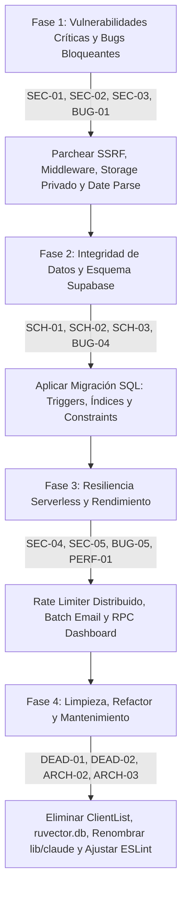

# Auditoría Integral de Código Fuente: Really-CRM
**Repositorio:** [`Really-CRM`](file:///Users/eduardotorres/Developer/Really-CRM)  
**Fecha:** 24 de Agosto, 2026  
**Alcance:** Código Fuente Completo (Next.js 16 App Router, TypeScript 5, React 19, Supabase SSR & Storage, Resend API).  
**Severidad Real:** CRITICAL / HIGH / MEDIUM / LOW  

---

## 1. Resumen Ejecutivo

Esta auditoría técnica evalúa el estado del código fuente de **Really-CRM**, una plataforma CRM inmobiliaria orientada a agentes de bienes raíces. La evaluación abarca seis dimensiones críticas: **Seguridad**, **Bugs de Lógica y Runtime**, **Arquitectura**, **Rendimiento**, **Código Muerto** y **Esquema de Base de Datos / RLS / Storage**.

### Distribución de Hallazgos por Severidad

```
🚨 CRITICAL  :  3 hallazgos (3 Seguridad)
🔴 HIGH      : 10 hallazgos (4 Seguridad, 2 Bugs, 1 Arquitectura, 1 Rendimiento, 2 Esquema)
🟡 MEDIUM    : 10 hallazgos (1 Seguridad, 4 Bugs, 2 Arquitectura, 1 Rendimiento, 2 Dead Code)
🟢 LOW       :  7 hallazgos (1 Seguridad, 1 Bugs, 1 Rendimiento, 3 Dead Code, 1 Esquema)
-----------------------------------------------------------------------------------------
TOTAL        : 30 hallazgos identificados y documentados con código de remediación
```

---

## 2. Matriz General de Hallazgos

| ID | Área | Título del Hallazgo | Severidad | Ubicación en Código |
| :--- | :--- | :--- | :---: | :--- |
| **SEC-01** | Seguridad / SSRF | Server-Side Request Forgery en Parser de Propiedades | 🚨 **CRITICAL** | [`lib/claude/propertyMatch.ts:107-115`](file:///Users/eduardotorres/Developer/Really-CRM/lib/claude/propertyMatch.ts#L107-L115) |
| **SEC-02** | Seguridad / Auth | Protección Incompleta de Rutas y APIs en Middleware | 🚨 **CRITICAL** | [`middleware.ts:42-49`](file:///Users/eduardotorres/Developer/Really-CRM/middleware.ts#L42-L49) |
| **SEC-03** | Seguridad / Privacidad | Exposición Pública de Documentos Confidenciales (PII / Contratos) | 🚨 **CRITICAL** | [`lib/storage/uploadFile.ts:18-19`](file:///Users/eduardotorres/Developer/Really-CRM/lib/storage/uploadFile.ts#L18-L19) |
| **SEC-04** | Seguridad / Rate Limit | Rate Limiter Volátil en Memoria Inefectivo en Serverless | 🔴 **HIGH** | [`lib/rateLimit.ts:2-15`](file:///Users/eduardotorres/Developer/Really-CRM/lib/rateLimit.ts#L2-L15) |
| **SEC-05** | Seguridad / Abuso | Endpoint de Envío de Email sin Rate Limiting | 🔴 **HIGH** | [`app/api/send-followup-email/route.ts:10-35`](file:///Users/eduardotorres/Developer/Really-CRM/app/api/send-followup-email/route.ts#L10-L35) |
| **SEC-06** | Seguridad / Phishing | Fallback de Dominio Hardcodeado a Host Externo en Cron | 🔴 **HIGH** | [`app/api/cron/send-daily-followups/route.ts:50`](file:///Users/eduardotorres/Developer/Really-CRM/app/api/cron/send-daily-followups/route.ts#L50) |
| **SEC-07** | Seguridad / Inyección | Inyección de Wildcards y Operadores en PostgREST ILIKE | 🔴 **HIGH** | [`app/(app)/clients/page.tsx:54-56`](file:///Users/eduardotorres/Developer/Really-CRM/app/%28app%29/clients/page.tsx#L54-L56) |
| **SEC-08** | Seguridad / Auth UX | Ausencia de Fallback de Origen en Login Client-Side | 🟡 **MEDIUM** | [`app/(auth)/login/page.tsx:32`](file:///Users/eduardotorres/Developer/Really-CRM/app/%28auth%29/login/page.tsx#L32) |
| **SEC-09** | Seguridad / CSP | Dominio Obsoleto de Anthropic en Content-Security-Policy | 🟢 **LOW** | [`next.config.ts:9`](file:///Users/eduardotorres/Developer/Really-CRM/next.config.ts#L9) |
| **BUG-01** | Bugs / Fechas | Desfase de Zona Horaria en Fechas de Follow-Up (`parseISO` UTC vs Local) | 🔴 **HIGH** | [`components/follow-ups/FollowUpCard.tsx:27-30`](file:///Users/eduardotorres/Developer/Really-CRM/components/follow-ups/FollowUpCard.tsx#L27-L30) |
| **BUG-02** | Bugs / Validación | Ausencia de Validación de Rangos Numéricos y Coerción NaN en Clientes | 🔴 **HIGH** | [`components/clients/ClientForm.tsx:31-45`](file:///Users/eduardotorres/Developer/Really-CRM/components/clients/ClientForm.tsx#L31-L45) |
| **BUG-03** | Bugs / React | Invocación de Hook React Hook Form (`watch`) dentro de `.map()` | 🟡 **MEDIUM** | [`components/clients/ClientForm.tsx:239`](file:///Users/eduardotorres/Developer/Really-CRM/components/clients/ClientForm.tsx#L239) |
| **BUG-04** | Bugs / Auditoría | Pérdida de Historial en Movimiento de Etapas en Kanban Pipeline | 🟡 **MEDIUM** | [`components/pipeline/PipelineBoard.tsx:50-65`](file:///Users/eduardotorres/Developer/Really-CRM/components/pipeline/PipelineBoard.tsx#L50-L65) |
| **BUG-05** | Bugs / Serverless | Loop Secuencial de Envío Masivo Propenso a Timeout | 🟡 **MEDIUM** | [`app/api/bulk-email/route.ts:70-95`](file:///Users/eduardotorres/Developer/Really-CRM/app/api/bulk-email/route.ts#L70-L95) |
| **BUG-06** | Bugs / Storage | Borrado de Documento Deja Archivo Físico Huérfano en Storage | 🟡 **MEDIUM** | [`components/documents/DocumentCard.tsx:48-55`](file:///Users/eduardotorres/Developer/Really-CRM/components/documents/DocumentCard.tsx#L48-L55) |
| **BUG-07** | Bugs / Timezone | Desalineación de Zona Horaria Servidor en Dashboard | 🟢 **LOW** | [`app/(app)/dashboard/page.tsx:16`](file:///Users/eduardotorres/Developer/Really-CRM/app/%28app%29/dashboard/page.tsx#L16) |
| **ARCH-01** | Arquitectura | Inconsistencia en Estrategia de Protección de Rutas (Middleware vs Layout) | 🔴 **HIGH** | [`middleware.ts:42-49`](file:///Users/eduardotorres/Developer/Really-CRM/middleware.ts#L42-L49) |
| **ARCH-02** | Arquitectura | Nomenclatura Legacy de Módulo Desacoplado de IA (`lib/claude/`) | 🟡 **MEDIUM** | [`lib/claude/propertyMatch.ts`](file:///Users/eduardotorres/Developer/Really-CRM/lib/claude/propertyMatch.ts) |
| **ARCH-03** | Arquitectura | Configuración de ESLint en Monorepo / Subcarpeta Landing | 🟡 **MEDIUM** | [`eslint.config.mjs:9-15`](file:///Users/eduardotorres/Developer/Really-CRM/eslint.config.mjs#L9-L15) |
| **PERF-01** | Rendimiento | Múltiples Roundtrips Consecutivos en Dashboard (6 consultas PostgREST) | 🔴 **HIGH** | [`app/(app)/dashboard/page.tsx:19-33`](file:///Users/eduardotorres/Developer/Really-CRM/app/%28app%29/dashboard/page.tsx#L19-L33) |
| **PERF-02** | Rendimiento | Paginación Ausente en Tablas de Clientes y Pipeline | 🟡 **MEDIUM** | [`app/(app)/clients/page.tsx:50-53`](file:///Users/eduardotorres/Developer/Really-CRM/app/%28app%29/clients/page.tsx#L50-L53) |
| **PERF-03** | Rendimiento | Fetch Redundante en `TemplatePicker` sin Caché | 🟢 **LOW** | [`components/templates/TemplatePicker.tsx:32-50`](file:///Users/eduardotorres/Developer/Really-CRM/components/templates/TemplatePicker.tsx#L32-L50) |
| **DEAD-01** | Código Muerto | Componente Huérfano `components/clients/ClientList.tsx` (128 líneas) | 🟡 **MEDIUM** | [`components/clients/ClientList.tsx`](file:///Users/eduardotorres/Developer/Really-CRM/components/clients/ClientList.tsx) |
| **DEAD-02** | Código Muerto | Base de Datos Binaria SQLite Huérfana (`ruvector.db` - 1.58 MB) | 🟡 **MEDIUM** | [`ruvector.db`](file:///Users/eduardotorres/Developer/Really-CRM/ruvector.db) |
| **DEAD-03** | Código Muerto | Primitivas UI No Utilizadas (`select.tsx`, `skeleton.tsx`) | 🟢 **LOW** | [`components/ui/select.tsx`](file:///Users/eduardotorres/Developer/Really-CRM/components/ui/select.tsx) |
| **DEAD-04** | Código Muerto | Variables de Entorno Obsoletas en `.env.example` (`ANTHROPIC_API_KEY`) | 🟢 **LOW** | [`.env.example:6-7`](file:///Users/eduardotorres/Developer/Really-CRM/.env.example#L6-L7) |
| **DEAD-05** | Código Muerto | Variable No Utilizada `_score` en `propertyMatch.ts` | 🟢 **LOW** | [`lib/claude/propertyMatch.ts:250`](file:///Users/eduardotorres/Developer/Really-CRM/lib/claude/propertyMatch.ts#L250) |
| **SCH-01** | Esquema / Índices | Falta de Índice Foráneo en `follow_ups(client_id)` | 🔴 **HIGH** | [`supabase/schema.sql:139-148`](file:///Users/eduardotorres/Developer/Really-CRM/supabase/schema.sql#L139-L148) |
| **SCH-02** | Esquema / Auditoría | Dependencia de Inserción Client-Side en `client_history` | 🔴 **HIGH** | [`supabase/schema.sql:107-135`](file:///Users/eduardotorres/Developer/Really-CRM/supabase/schema.sql#L107-L135) |
| **SCH-03** | Esquema / Integridad | Ausencia de Restricciones CHECK en Rangos y Precios | 🔴 **HIGH** | [`supabase/schema.sql:45-53`](file:///Users/eduardotorres/Developer/Really-CRM/supabase/schema.sql#L45-L53) |
| **SCH-04** | Esquema / Storage | Riesgo de Archivos Huérfanos en Borrados en Cascada | 🔴 **HIGH** | [`supabase/schema.sql:77`](file:///Users/eduardotorres/Developer/Really-CRM/supabase/schema.sql#L77) |
| **SCH-05** | Esquema / Índices | Falta de Índices Compuestos en `documents` y `client_history` | 🟡 **MEDIUM** | [`supabase/schema.sql:139-148`](file:///Users/eduardotorres/Developer/Really-CRM/supabase/schema.sql#L139-L148) |
| **SCH-06** | Esquema / Integridad | Falta de Restricción UNIQUE en `profiles.email` | 🟡 **MEDIUM** | [`supabase/schema.sql:23`](file:///Users/eduardotorres/Developer/Really-CRM/supabase/schema.sql#L23) |

---

## 3. Estructura de Reportes Detallados

Para examinar los detalles técnicos completos, causas raíz, código vulnerable y parches recomendados, consulte los reportes temáticos en `.audit/`:

1. **[Reporte de Seguridad y Bugs (Security & Bugs)](file:///Users/eduardotorres/Developer/Really-CRM/.audit/SECURITY_AND_BUGS_REPORT.md)**  
   *Análisis exhaustivo de SSRF, omisiones de Middleware, exposición de PII en Storage, bugs de zona horaria con date-fns, validación Zod y timeouts serverless.*

2. **[Reporte de Arquitectura, Rendimiento y Código Muerto](file:///Users/eduardotorres/Developer/Really-CRM/.audit/CODEBASE_ARCHITECTURE_AND_PERFORMANCE.md)**  
   *Evaluación estructural del App Router de Next.js 16, optimización de queries PostgREST, eliminación de 1.58 MB de binarios huérfanos y limpieza de dead code.*

3. **[Reporte y Auditoría del Esquema Supabase (Database Schema & RLS)](file:///Users/eduardotorres/Developer/Really-CRM/.audit/SUPABASE_SCHEMA_AUDIT.md)**  
   *Auditoría de integridad relacional, triggers automáticos para client_history, índices foráneos faltantes, políticas RLS y script de migración SQL correctivo.*

---

## 4. Plan de Acción y Prioridades de Remediación



### Pasos Inmediatos Recomendados
1. **SSRF Guard:** Implementar validación estricta de URLs (solo `http:` / `https:`, resolución DNS previa y bloqueo de rangos privados `10.0.0.0/8`, `172.16.0.0/12`, `192.168.0.0/16`, `127.0.0.1`, `169.254.169.254`).
2. **Middleware Matcher:** Actualizar `middleware.ts` para cubrir `/pipeline`, `/templates` y unificar el control de acceso en APIs.
3. **Signed URLs en Documentos:** Cambiar el bucket `documents` a privado y generar URLs firmadas temporales (`createSignedUrl`) en lugar de `getPublicUrl`.
4. **Timezone Bug Fix:** Corregir el parsing de fechas `YYYY-MM-DD` en `FollowUpCard.tsx` para evitar que `parseISO` fuerce UTC midnight y marque tareas de hoy como vencidas en husos horarios occidentales.
5. **Migración SQL:** Ejecutar el script SQL proporcionado en [`SUPABASE_SCHEMA_AUDIT.md`](file:///Users/eduardotorres/Developer/Really-CRM/.audit/SUPABASE_SCHEMA_AUDIT.md#script-de-migración-sql-recomendado) para añadir índices foráneos, restricciones CHECK y triggers automáticos de auditoría.
